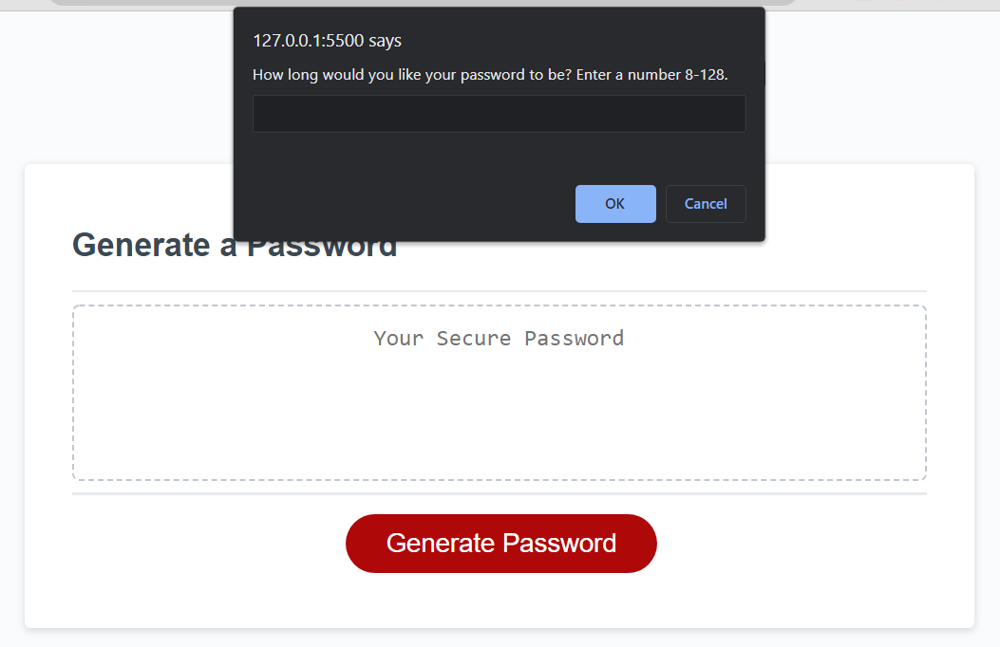
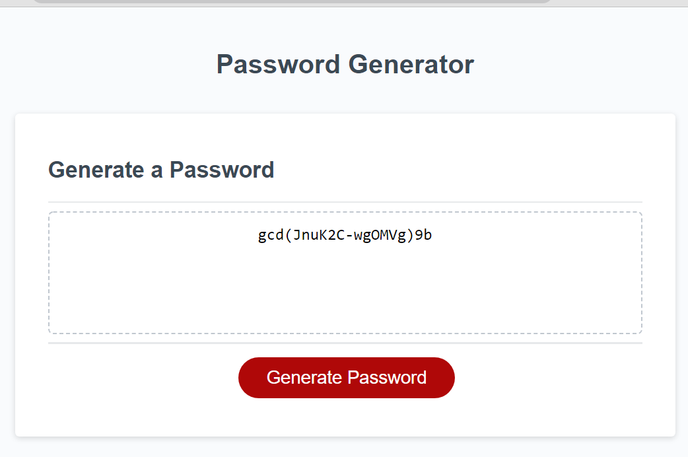

# Password Generator

A simple password generator that gathers the user's password criteria through a series of browser prompts.

## Challenges

In this challenge I had to use what we learned about JavaScript in this past week's module to generate a random password that can differ greatly depending on the user's answers to the prompts. Creating the prompts and combining the users selected characters together into an array was straightforward. I was honestly stumped when it came time to actually get the program to gather random characters from the selectedChar array. I knew I would need to use math.random eventually, but I wasn't entirely sure how to get it to work with an array. I ended up going with a for loop that will 'grab' one character from an selectedChar array at a time and repeat until it had enough characters to meet the users password length request. These characters were then added to a password array and converted to a string using the join method.

The deployed application can be found [here](https://mannygarcia98.github.io/Challenge-3-Password-Gen/).
 Below are the challenge requirements.

## User Story

AS AN employee with access to sensitive data
 I WANT to randomly generate a password that meets certain criteria
 SO THAT I can create a strong password that provides greater security

## Acceptance Criteria

GIVEN I need a new, secure password
 WHEN I click the button to generate a password
 THEN I am presented with a series of prompts for password criteria
 WHEN prompted for password criteria
 THEN I select which criteria to include in the password
 WHEN prompted for the length of the password
 THEN I choose a length of at least 8 characters and no more than 128 characters
 WHEN asked for character types to include in the password
 THEN I confirm whether or not to include lowercase, uppercase, numeric, and/or special characters
 WHEN I answer each prompt
 THEN my input should be validated and at least one character type should be selected
 WHEN all prompts are answered
 THEN a password is generated that matches the selected criteria
 WHEN the password is generated
 THEN the password is either displayed in an alert or written to the page
